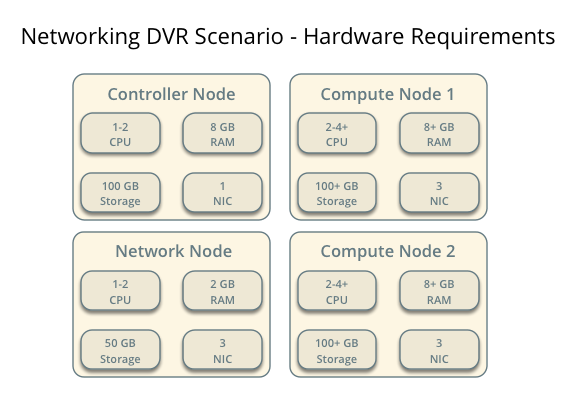
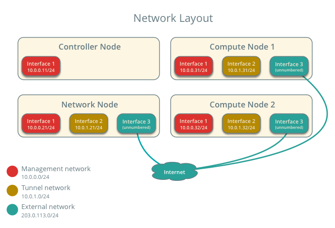
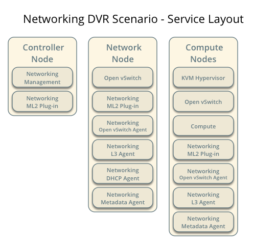
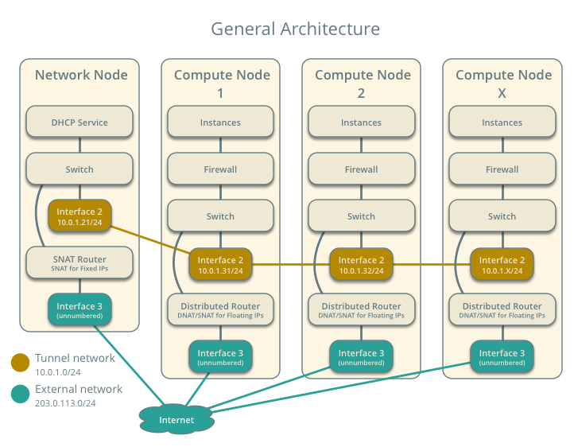
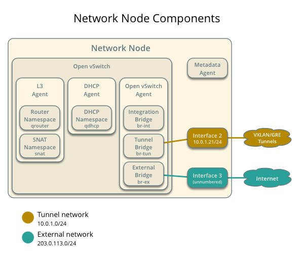
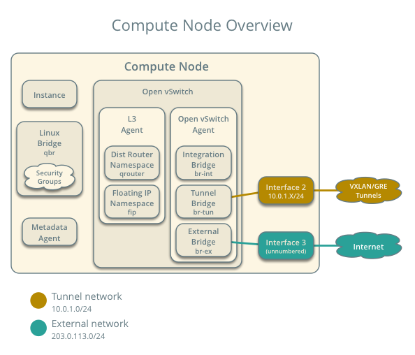
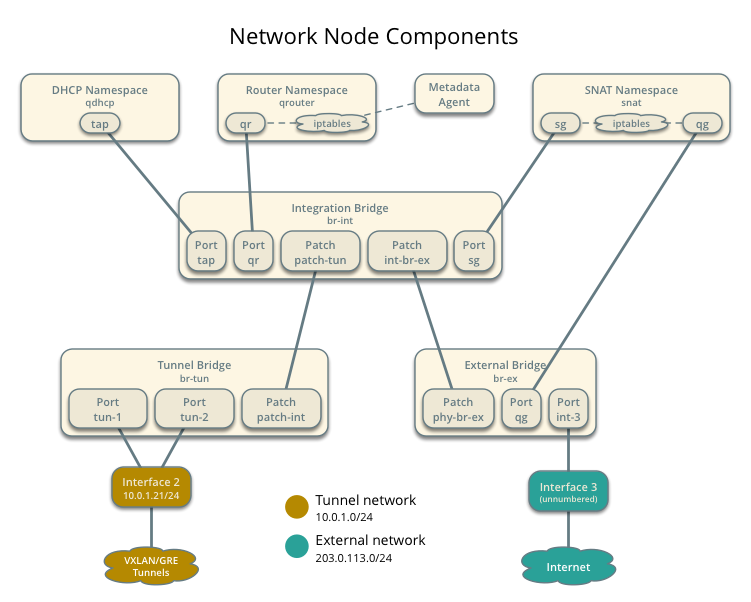
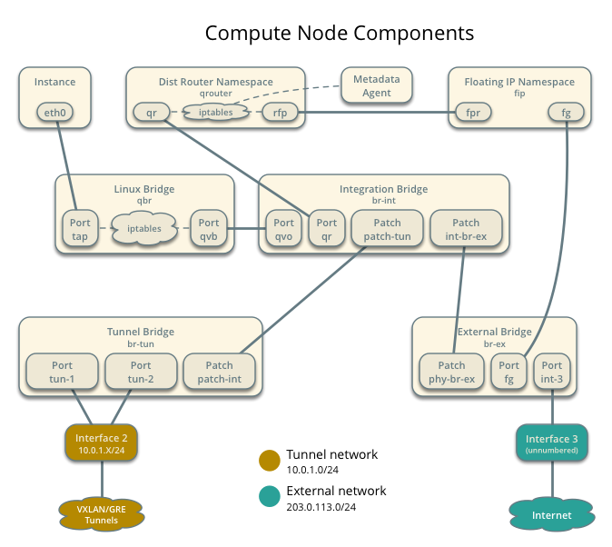

# Scenario: Basic implementation of DVR

This scenario describes a basic implementation of the distributed virtual
router (DVR) redundancy feature using the ML2 plug-in with Open vSwitch, one
flat external network, and VXLAN tenant networks. It can support VLAN
external networks with minor modifications.

## Requirements

1. One controller node with one network interface: management.

1. One network node with three network interfaces: management, instance
   tunnels, and external/internet. The OVS bridge 'br-ex' must contain a
   port on the external/internet interface.

1. Two compute nodes with three network interfaces: management, instance
   tunnels, and external/internet. The OVS bridge 'br-ex' must contain a
   port on the external/internet interface.





Note: Proper operation of DVR requires Open vSwitch 2.1 or newer and VXLAN
requires kernel 3.13 or better. In general, only Fedora 20 currently meets
or exceeds these minimum versions.

## Prerequisites

1. Controller node

  1. Operational SQL server with 'neutron' database with appropriate
     configuration in the neutron-server.conf file.

  1. Operational message queue service with appropriate configuration
     in the neutron-server.conf file.

  1. Operational OpenStack Identity service with appropriate configuration
     in the neutron-server.conf file.

  1. Operational OpenStack Compute controller/management service with
     appropriate configuration to use neutron in the nova.conf file.

  1. Neutron server service, ML2 plug-in, and any dependencies.

1. Network node

  1. Operational OpenStack Identity service with appropriate configuration
     in the neutron-server.conf file.

  1. Open vSwitch service, ML2 plug-in, Open vSwitch agent, L3 agent,
     DHCP agent, metadata agent, and any dependencies including the
     'ipset' and 'conntrack' utilities.

1. Compute nodes

  1. Operational OpenStack Identity service with appropriate configuration
     in the neutron-server.conf file.

  1. Operational OpenStack Compute controller/management service with
     appropriate configuration to use neutron in the nova.conf file.

  1. Open vSwitch service, ML2 plug-in, Open vSwitch agent, L3 agent,
     metadata agent, and any dependencies including the 'ipset' and
     'conntrack' utilities.



## Architecture

### General







### Components





### Network traffic flows

## Configuration

### Controller node (controller)

The controller node provides the neutron API and manages services on the
other nodes.

1. Configure base options.

   1. Edit the /etc/neutron/neutron.conf file.

    ```
    [DEFAULT]
    verbose = True
    router_distributed = True
    core_plugin = ml2
    service_plugins = router
    allow_overlapping_ips = True
    allow_automatic_l3agent_failover = True

    notify_nova_on_port_status_changes = True
    notify_nova_on_port_data_changes = True
    nova_url = http://controller:8774/v2
    nova_region_name = regionOne
    nova_admin_username = NOVA_ADMIN_USERNAME
    nova_admin_tenant_id = NOVA_ADMIN_TENANT_ID
    nova_admin_password =  NOVA_ADMIN_PASSWORD
    nova_admin_auth_url = http://controller:35357/v2.0
    ```

  Note: Replace NOVA_ADMIN_USERNAME, NOVA_ADMIN_TENANT_ID, and
  NOVA_ADMIN_PASSWORD with suitable values for your environment.


1. Configure the ML2 plug-in.

  1. Edit the /etc/neutron/plugins/ml2/ml2_conf.ini file.

    ```
    [ml2]
    type_drivers = flat,vxlan
    tenant_network_types = vxlan
    mechanism_drivers = openvswitch,l2population

    [ml2_type_vxlan]
    vni_ranges = 1:1000
    vxlan_group = 239.1.1.1

    [securitygroup]
    enable_security_group = True
    firewall_driver = neutron.agent.linux.iptables_firewall.OVSHybridIptablesFirewallDriver
    enable_ipset = True
    ```

1. Start the following services:

  * Server

### Network node (network1)

The network node provides DHCP service to all instances and SNAT service to
instances without floating IP addresses.

1. Configure base options.

  1. Edit the /etc/neutron/neutron.conf file.

    ```
    [DEFAULT]
    verbose = True
    router_distributed = True
    core_plugin = ml2
    service_plugins = router
    allow_overlapping_ips = True
    allow_automatic_l3agent_failover = True
    ```

1. Configure the ML2 plug-in.

  1. Edit the /etc/neutron/plugins/ml2/ml2_conf.ini file.

    ```
    [ml2]
    type_drivers = flat,vxlan
    tenant_network_types = vxlan
    mechanism_drivers = openvswitch,l2population

    [ml2_type_flat]
    flat_networks = external

    [ml2_type_vxlan]
    vni_ranges = 1:1000
    vxlan_group = 239.1.1.1

    [securitygroup]
    enable_security_group = True
    enable_ipset = True
    firewall_driver = neutron.agent.linux.iptables_firewall.OVSHybridIptablesFirewallDriver

    [ovs]
    local_ip = TENANT_NETWORK_TUNNELS_INTERFACE_IP_ADDRESS
    enable_tunneling = True
    bridge_mappings = external:br-ex

    [agent]
    l2population = True
    tunnel_types = vxlan
    enable_distributed_routing = True
    arp_responder = True
    ```

  Note: Replace TENANT_NETWORK_TUNNELS_INTERFACE_IP_ADDRESS with the IP
  address of the tenant network tunnels interface.

1. Configure the L3 agent.

  1. Edit the /etc/neutron/l3_agent.ini file.

    ```
    [DEFAULT]
    verbose = True
    interface_driver = neutron.agent.linux.interface.OVSInterfaceDriver
    use_namespaces = True
    external_network_bridge = br-ex
    router_delete_namespaces = True
    agent_mode = dvr_snat
    ```

1. Configure the DHCP agent.

  1. Edit the /etc/neutron/dhcp_agent.ini file.

    ```
    verbose = True
    interface_driver = neutron.agent.linux.interface.OVSInterfaceDriver
    dhcp_driver = neutron.agent.linux.dhcp.Dnsmasq
    use_namespaces = True
    dhcp_delete_namespaces = True
    ```

  1. (Optional) Reduce MTU for VXLAN tenant networks.

    1. Edit the /etc/neutron/dhcp_agent.ini file.

    ```
    dnsmasq_config_file = /etc/neutron/dnsmasq-neutron.conf
    ```

    1. Edit the /etc/neutron/dnsmasq-neutron.conf file.

    ```
    dhcp-option-force=26,1450
    ```

1. Configure the metadata agent.

  1. Edit the /etc/neutron/metadata_agent.ini file.

    ```
    [DEFAULT]
    verbose = True
    auth_url = http://controller:5000/v2.0
    auth_region = regionOne
    admin_tenant_name = ADMIN_TENANT_NAME
    admin_user = ADMIN_USER
    admin_password = ADMIN_PASSWORD
    nova_metadata_ip = controller
    metadata_proxy_shared_secret = METADATA_SECRET
    ```

  Note: Replace ADMIN_TENANT_NAME, ADMIN_USER, ADMIN_PASSWORD, and
  METADATA_SECRET with suitable values for your environment.

1. Start the following services:

  * Open vSwitch
  * Open vSwitch agent
  * L3 agent
  * DHCP agent
  * Metadata agent

### Compute nodes (compute1 and compute2)

The compute nodes contain the DVR components and handle floating IP
addresses.

1. Configure base options.

  1. Edit the /etc/neutron/neutron.conf file.

    ```
    [DEFAULT]
    verbose = True
    router_distributed = True
    core_plugin = ml2
    service_plugins = router
    allow_overlapping_ips = True
    ```

1. Configure the ML2 plug-in.

  1. Edit the /etc/neutron/plugins/ml2/ml2_conf.ini file.

    ```
    [ml2]
    type_drivers = flat,vxlan
    tenant_network_types = vxlan
    mechanism_drivers = openvswitch,l2population

    [ml2_type_flat]
    flat_networks = external

    [ml2_type_vxlan]
    vni_ranges = 1:1000
    vxlan_group = 239.1.1.1

    [securitygroup]
    enable_security_group = True
    enable_ipset = True
    firewall_driver = neutron.agent.linux.iptables_firewall.OVSHybridIptablesFirewallDriver

    [ovs]
    local_ip = TENANT_NETWORK_TUNNELS_INTERFACE_IP_ADDRESS
    enable_tunneling = True
    bridge_mappings = external:br-ex

    [agent]
    l2population = True
    tunnel_types = vxlan
    enable_distributed_routing = True
    arp_responder = True
    ```

  Note: Replace TENANT_NETWORK_TUNNELS_INTERFACE_IP_ADDRESS with the IP
  address of the tenant network tunnels interface.

1. Configure the L3 agent.

  1. Edit the /etc/neutron/l3_agent.ini file.

    ```
    [DEFAULT]
    verbose = True
    interface_driver = neutron.agent.linux.interface.OVSInterfaceDriver
    use_namespaces = True
    router_delete_namespaces = True
    agent_mode = dvr
    ```

1. Configure the metadata agent.

  1. Edit the /etc/neutron/metadata_agent.ini file.

    ```
    [DEFAULT]
    verbose = True
    auth_url = http://controller:5000/v2.0
    auth_region = regionOne
    admin_tenant_name = ADMIN_TENANT_NAME
    admin_user = ADMIN_USER
    admin_password = ADMIN_PASSWORD
    nova_metadata_ip = controller
    metadata_proxy_shared_secret = METADATA_SECRET
    ```

  Note: Replace ADMIN_TENANT_NAME, ADMIN_USER, ADMIN_PASSWORD, and
  METADATA_SECRET with suitable values for your environment.

1. Start the following services:

  * Open vSwitch
  * Open vSwitch agent
  * L3 agent
  * Metadata agent

### Verify service operation

1. Source the administrative tenant credentials.

1. Verify presence and operation of the agents.

  ```
  $ neutron agent-list
  +--------------------------------------+--------------------+----------+-------+----------------+---------------------------+
  | id                                   | agent_type         | host     | alive | admin_state_up | binary                    |
  +--------------------------------------+--------------------+----------+-------+----------------+---------------------------+
  | 10b084e5-4ab8-43d6-9b04-6d56f27f9cd4 | Metadata agent     | network1 | :-)   | True           | neutron-metadata-agent    |
  | 2f90ef81-3eed-4ecf-b6b9-2d2c21dda85c | Open vSwitch agent | compute2 | :-)   | True           | neutron-openvswitch-agent |
  | 319563ac-88f9-4352-b63e-e55beb673372 | DHCP agent         | network1 | :-)   | True           | neutron-dhcp-agent        |
  | 3345723e-16e8-4b74-9d15-d7f1f977a3bd | Open vSwitch agent | compute1 | :-)   | True           | neutron-openvswitch-agent |
  | 4643c811-a54a-41da-91a8-c2328bcaeea3 | Open vSwitch agent | network1 | :-)   | True           | neutron-openvswitch-agent |
  | 5ad81671-efc3-4acc-9d5d-030a1c4f6a25 | L3 agent           | compute1 | :-)   | True           | neutron-l3-agent          |
  | 641337fa-99c2-468d-8d7e-89277d6ba144 | Metadata agent     | compute1 | :-)   | True           | neutron-metadata-agent    |
  | 9372e008-bd29-4436-8e01-8ddfd50d2b74 | L3 agent           | network1 | :-)   | True           | neutron-l3-agent          |
  | af9d1169-1012-4440-9de2-778c8fce21b9 | L3 agent           | compute2 | :-)   | True           | neutron-l3-agent          |
  | ee59e3ba-ee3c-4621-b3d5-c9d8123b6cc5 | Metadata agent     | compute2 | :-)   | True           | neutron-metadata-agent    |
  +--------------------------------------+--------------------+----------+-------+----------------+---------------------------+
  ```

## Create initial networks

### External (flat) network

1. Source the administrative tenant credentials.

1. Create the external network.

  ```
  $ neutron net-create ext-net --shared --router:external True \
    --provider:physical_network external --provider:network_type flat
  Created a new network:
  +---------------------------+--------------------------------------+
  | Field                     | Value                                |
  +---------------------------+--------------------------------------+
  | admin_state_up            | True                                 |
  | id                        | 893aebb9-1c1e-48be-8908-6b947f3237b3 |
  | name                      | ext-net                              |
  | provider:network_type     | flat                                 |
  | provider:physical_network | external                             |
  | provider:segmentation_id  |                                      |
  | router:external           | True                                 |
  | shared                    | True                                 |
  | status                    | ACTIVE                               |
  | subnets                   |                                      |
  | tenant_id                 | 54cd044c64d5408b83f843d63624e0d8     |
  +---------------------------+--------------------------------------+
  ```

1. Create a subnet on the external network.

  ```
  $ neutron subnet-create ext-net --name ext-subnet --allocation-pool \
    start=203.0.113.101,end=203.0.113.200 --disable-dhcp \
    --gateway 203.0.113.1 203.0.113.0/24
  Created a new subnet:
  +-------------------+------------------------------------------------------+
  | Field             | Value                                                |
  +-------------------+------------------------------------------------------+
  | allocation_pools  | {"start": "203.0.113.101", "end": "203.0.113.200"}   |
  | cidr              | 203.0.113.0/24                                       |
  | dns_nameservers   |                                                      |
  | enable_dhcp       | False                                                |
  | gateway_ip        | 203.0.113.1                                          |
  | host_routes       |                                                      |
  | id                | 9159f0dc-2b63-41cf-bd7a-289309da1391                 |
  | ip_version        | 4                                                    |
  | ipv6_address_mode |                                                      |
  | ipv6_ra_mode      |                                                      |
  | name              | ext-subnet                                           |
  | network_id        | 893aebb9-1c1e-48be-8908-6b947f3237b3                 |
  | tenant_id         | 54cd044c64d5408b83f843d63624e0d8                     |
  +-------------------+------------------------------------------------------+
  ```

### Tenant (VXLAN) network

1. Source the regular tenant credentials.

1. Create the tenant network.

  ```
  $ neutron net-create demo-net
  Created a new network:
  +-----------------+--------------------------------------+
  | Field           | Value                                |
  +-----------------+--------------------------------------+
  | admin_state_up  | True                                 |
  | id              | ac108952-6096-4243-adf4-bb6615b3de28 |
  | name            | demo-net                             |
  | router:external | False                                |
  | shared          | False                                |
  | status          | ACTIVE                               |
  | subnets         |                                      |
  | tenant_id       | cdef0071a0194d19ac6bb63802dc9bae     |
  +-----------------+--------------------------------------+
  ```

1. Create a subnet on the tenant network.

  ```
  $ neutron subnet-create demo-net --name demo-subnet --gateway 192.168.1.1 192.168.1.0/24
  Created a new subnet:
  +-------------------+------------------------------------------------------+
  | Field             | Value                                                |
  +-------------------+------------------------------------------------------+
  | allocation_pools  | {"start": "192.168.1.2", "end": "192.168.1.254"}     |
  | cidr              | 192.168.1.0/24                                       |
  | dns_nameservers   |                                                      |
  | enable_dhcp       | True                                                 |
  | gateway_ip        | 192.168.1.1                                          |
  | host_routes       |                                                      |
  | id                | 69d38773-794a-4e49-b887-6de6734e792d                 |
  | ip_version        | 4                                                    |
  | ipv6_address_mode |                                                      |
  | ipv6_ra_mode      |                                                      |
  | name              | demo-subnet                                          |
  | network_id        | ac108952-6096-4243-adf4-bb6615b3de28                 |
  | tenant_id         | cdef0071a0194d19ac6bb63802dc9bae                     |
  +-------------------+------------------------------------------------------+
  ```

1. Source the administrative tenant credentials.

1. Obtain the tenant ID for the regular tenant. The next step uses
   *cdef0071a0194d19ac6bb63802dc9bae* as an example.

1. Create a distributed virtual router.

  ```
  $ neutron router-create --tenant-id REGULAR_TENANT_ID \
    --distributed True demo-router
  Created a new router:
  +-----------------------+--------------------------------------+
  | Field                 | Value                                |
  +-----------------------+--------------------------------------+
  | admin_state_up        | True                                 |
  | distributed           | True                                 |
  | external_gateway_info |                                      |
  | ha                    | False                                |
  | id                    | 635660ae-a254-4feb-8993-295aa9ec6418 |
  | name                  | demo-router                          |
  | routes                |                                      |
  | status                | ACTIVE                               |
  | tenant_id             | cdef0071a0194d19ac6bb63802dc9bae     |
  +-----------------------+--------------------------------------+
  ```

  Replace REGULAR_TENANT_ID with the tenant ID of the regular tenant.

1. Add a tenant subnet interface on the router.

  ```
  $ neutron router-interface-add demo-router demo-subnet
  Added interface b1a894fd-aee8-475c-9262-4342afdc1b58 to router demo-router.
  ```

1. Add a gateway to the external network on the router.

  ```
  $ neutron router-gateway-set demo-router ext-net
  Set gateway for router demo-router
  ```

## Verify operation

1. On the network node, verify creation of the 'snat', 'qrouter', and 'qdhcp'
   namespaces.

  ```
  # ip netns
  snat-4d7928a0-4a3c-4b99-b01b-97da2f97e279
  qrouter-4d7928a0-4a3c-4b99-b01b-97da2f97e279
  qdhcp-353f5937-a2d3-41ba-8225-fa1af2538141
  ```

1. On the controller node, ping the tenant router gateway IP address,
   typically the lowest IP address in the external network subnet
   allocation range.

  ```
  # ping -c 4 203.0.113.101
  PING 203.0.113.101 (203.0.113.101) 56(84) bytes of data.
  64 bytes from 203.0.113.101: icmp_req=1 ttl=64 time=0.619 ms
  64 bytes from 203.0.113.101: icmp_req=2 ttl=64 time=0.189 ms
  64 bytes from 203.0.113.101: icmp_req=3 ttl=64 time=0.165 ms
  64 bytes from 203.0.113.101: icmp_req=4 ttl=64 time=0.216 ms

  --- 203.0.113.101 ping statistics ---
  4 packets transmitted, 4 received, 0% packet loss, time 2999ms
  rtt min/avg/max/mdev = 0.165/0.297/0.619/0.187 ms
  ```

1. Source the regular tenant credentials.

1. Launch an instance with an interface on the tenant network.

1. On the compute node with the instance, verify creation of the 'qrouter'
   namespace.

  ```
  # ip netns
  qrouter-4d7928a0-4a3c-4b99-b01b-97da2f97e279
  ```

1. Obtain console access to the instance.

  1. Test connectivity to the tenant network router.

    ```
    $ ping -c 4 192.168.1.1
    PING 192.168.1.1 (192.168.1.1) 56(84) bytes of data.
    64 bytes from 192.168.1.1: icmp_req=1 ttl=64 time=0.357 ms
    64 bytes from 192.168.1.1: icmp_req=2 ttl=64 time=0.473 ms
    64 bytes from 192.168.1.1: icmp_req=3 ttl=64 time=0.504 ms
    64 bytes from 192.168.1.1: icmp_req=4 ttl=64 time=0.470 ms

    --- 192.168.1.1 ping statistics ---
    4 packets transmitted, 4 received, 0% packet loss, time 2998ms
    rtt min/avg/max/mdev = 0.357/0.451/0.504/0.055 ms
    ```

  1. Test connectivity to the internet.

    ```
    $ ping -c 4 openstack.org
    PING openstack.org (174.143.194.225) 56(84) bytes of data.
    64 bytes from 174.143.194.225: icmp_req=1 ttl=53 time=17.4 ms
    64 bytes from 174.143.194.225: icmp_req=2 ttl=53 time=17.5 ms
    64 bytes from 174.143.194.225: icmp_req=3 ttl=53 time=17.7 ms
    64 bytes from 174.143.194.225: icmp_req=4 ttl=53 time=17.5 ms

    --- openstack.org ping statistics ---
    4 packets transmitted, 4 received, 0% packet loss, time 3003ms
    rtt min/avg/max/mdev = 17.431/17.575/17.734/0.143 ms
    ```

1. Create the appropriate security group rules to allow ping and SSH access
   to the instance.

1. Create a floating IP address.

  ```
  $ neutron floatingip-create ext-net
  Created a new floatingip:
  +---------------------+--------------------------------------+
  | Field               | Value                                |
  +---------------------+--------------------------------------+
  | fixed_ip_address    |                                      |
  | floating_ip_address | 203.0.113.102                        |
  | floating_network_id | 9bce64a3-a963-4c05-bfcd-161f708042d1 |
  | id                  | 05e36754-e7f3-46bb-9eaa-3521623b3722 |
  | port_id             |                                      |
  | router_id           |                                      |
  | status              | DOWN                                 |
  | tenant_id           | 7cf50047f8df4824bc76c2fdf66d11ec     |
  +---------------------+--------------------------------------+
  ```

1. Associate the floating IP address with the instance.

  ```
  $ nova floating-ip-associate demo-instance1 203.0.113.102
  ```

1. On the compute node with the instance, verify creation of the 'fip'
   namespace.

  ```
  # ip netns
  fip-2c7bd9c2-8ab0-46ef-b7c1-023ce0452c24
  ```

1. On the controller node, ping the floating IP address associated with
   the instance.

  ```
  $ ping -c 4 203.0.113.102
  PING 203.0.113.102 (203.0.113.112) 56(84) bytes of data.
  64 bytes from 203.0.113.102: icmp_req=1 ttl=63 time=3.18 ms
  64 bytes from 203.0.113.102: icmp_req=2 ttl=63 time=0.981 ms
  64 bytes from 203.0.113.102: icmp_req=3 ttl=63 time=1.06 ms
  64 bytes from 203.0.113.102: icmp_req=4 ttl=63 time=0.929 ms

  --- 203.0.113.102 ping statistics ---
  4 packets transmitted, 4 received, 0% packet loss, time 3002ms
  rtt min/avg/max/mdev = 0.929/1.539/3.183/0.951 ms
  ```
