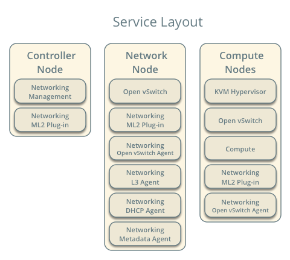
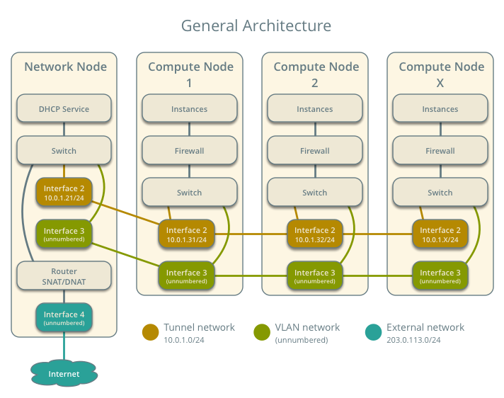
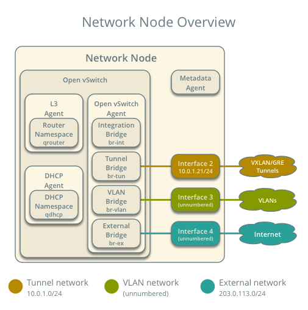
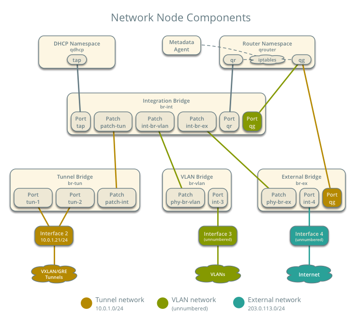
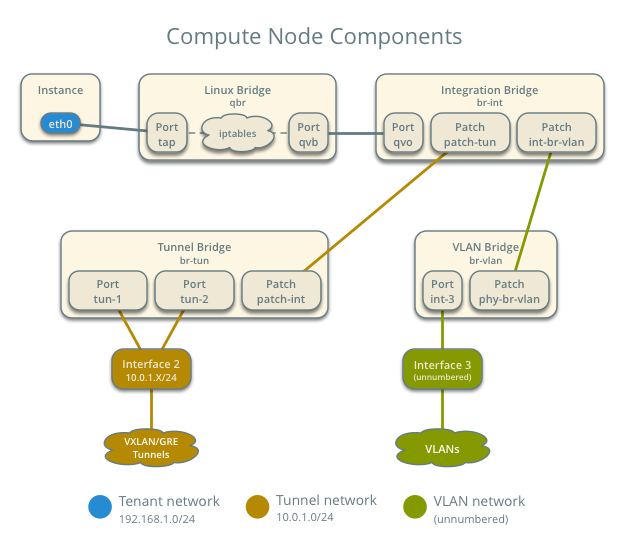
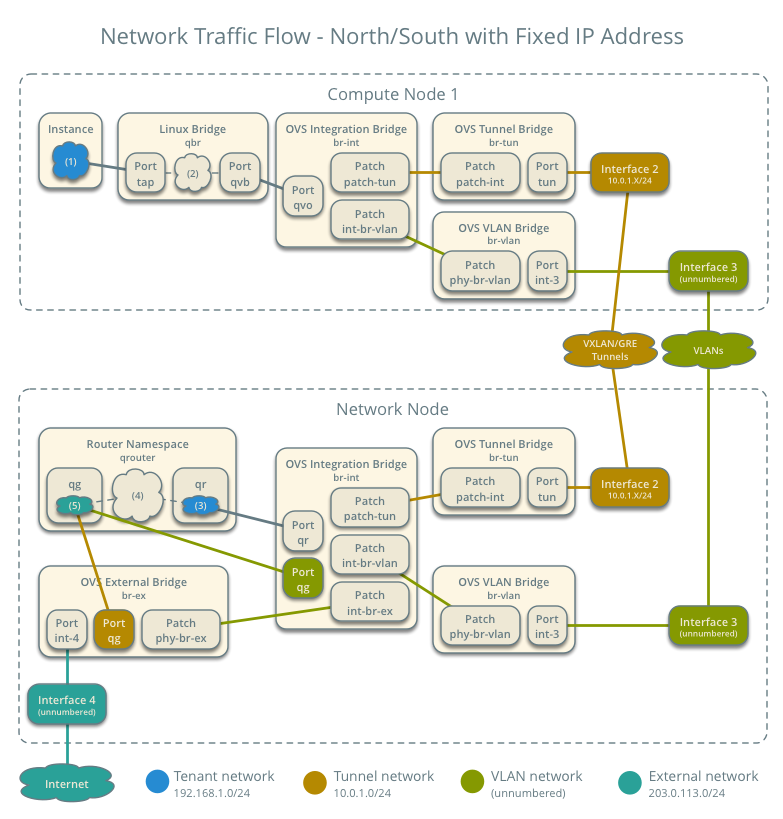
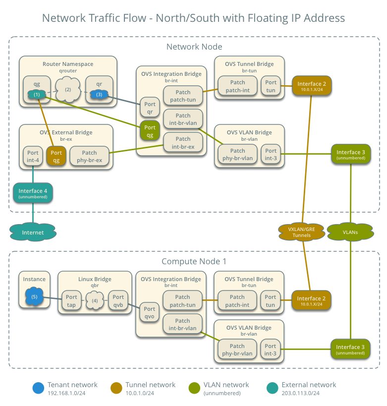

# Scenario: Legacy implementation with Open vSwitch

This scenario describes a legacy (basic) implementation of the
OpenStack Networking service using the ML2 plug-in with Open vSwitch.
The example configuration creates one flat external network and VXLAN
tenant networks. However, this configuration also supports VLAN
external networks, VLAN tenant networks, and GRE tenant networks.

To improve understanding of network traffic flow, the network and compute
nodes contain a separate network interface for tenant VLAN networks. In
production environments, tenant VLAN networks can use any Open vSwitch
bridge with access to a network interface. For example, the `br-tun`
bridge.

## Requirements

1. One controller node with one network interface: management.

1. One network node with four network interfaces: management, tenant tunnel
   networks, tenant VLAN networks, and external (typically the Internet).
   The Open vSwitch bridge `br-ex` must contain a port on the external
   interface.

1. At least one compute nodes with three network interfaces: management,
   tenant tunnel networks, and tenant VLAN networks.


**Warning: Proper operation of VLAN requires kernel 3.13 or newer. In
general, only Ubuntu 14.04, Fedora 20, and Fedora 21 meet or exceed this
minimum version requirement when using packages rather than source.**

## Prerequisites

1. Controller node

  1. Operational SQL server with `neutron` database and appropriate
     configuration in the neutron-server.conf file.

  1. Operational message queue service with appropriate configuration
     in the neutron-server.conf file.

  1. Operational OpenStack Identity service with appropriate configuration
     in the neutron-server.conf file.

  1. Operational OpenStack Compute controller/management service with
     appropriate configuration to use neutron in the nova.conf file.

  1. Neutron server service, ML2 plug-in, and any dependencies.

1. Network node

  1. Operational OpenStack Identity service with appropriate configuration
     in the neutron-server.conf file.

  1. Open vSwitch service, ML2 plug-in, Open vSwitch agent, L3 agent,
     DHCP agent, metadata agent, and any dependencies including the
     `ipset` utility.

1. Compute nodes

  1. Operational OpenStack Identity service with appropriate configuration
     in the neutron-server.conf file.

  1. Operational OpenStack Compute controller/management service with
     appropriate configuration to use neutron in the nova.conf file.

  1. Open vSwitch service, ML2 plug-in, Open vSwitch agent, and any
     dependencies including the `ipset` utility.



## Architecture

### General

The legacy architecture provides basic virtual networking components in
your environment. Routing among tenant and external networks resides
completely on the network node. Although more simple to deploy than
other architectures, performing all functions on the network node
creates a single point of failure and potential performance issues.
Consider deploying DVR or L3 HA architectures in production environments
to provide redundancy and increase performance.



The network node runs the Open vSwitch agent, L3 agent, DHCP agent, and
metadata agent.



The compute nodes run the Open vSwitch agent.


### Components

The network node contains the following components:

1. Open vSwitch agent managing virtual switches, connectivity among
   them, and interaction via virtual ports with other network components
   such as namespaces, Linux bridges, and underlying interfaces.

1. DHCP agent managing the `qdhcp` namespaces.

  1. The `dhcp` namespaces provide DHCP services for instances using 
     tenant networks.

1. L3 agent managing the `qrouter` namespaces.

  1. The `qrouter` namespaces provide routing between tenant and external
     networks and among tenant networks. They also route metadata traffic
     between instances and the metadata agent.

1. Metadata agent handling metadata operations.

  1. The metadata agent handles metadata operations for instances.



The compute nodes contain the following components:

1. Open vSwitch agent managing virtual switches, connectivity among
   them, and interaction via virtual ports with other network components
   such as namespaces, Linux bridges, and underlying interfaces.

1. Linux bridges handling security groups.

  1. Due to limitations with Open vSwitch and *iptables*, the Networking
     service uses a Linux bridge to manage security groups for
     instances.



## Packet flow

### Case 1: North-south for instances without a floating IP address

For instances without a floating IP address, the network node routes
*north-south* network traffic between tenant and external networks.

Note: The term *north-south* generally defines network traffic that
travels between tenant and external networks (typically the Internet).

#### Example environment configuration

Instance 1 resides on compute node 1 and uses tenant network 1.
The instance sends a packet to a host on the external network.

* External network 1

  * Network 203.0.113.0/24

  * Gateway 203.0.113.1 with MAC address *EG1*

  * Floating IP range 203.0.113.101 to 203.0.113.200

  * Tenant network 1 router interface 203.0.113.101 *TR1*

* Tenant network 1

  * Network 192.168.1.0/24

  * Gateway 192.168.1.1 with MAC address *TG1*

* Compute node 1

  * Instance 1 192.168.1.11 with MAC address *I1*

#### Packet flow

The following steps involve compute node 1.

1. The instance 1 `tap` interface (1) forwards the packet to the Linux
   bridge `qbr`. The packet contains destination MAC address *TG1*
   because the destination resides on another network.

1. Security group rules (2) on the Linux bridge `qbr` handle state tracking
   for the packet.

1. The Linux bridge `qbr` forwards the packet to the Open vSwitch
   integration bridge `br-int`.

1. The Open vSwitch integration bridge `br-int` adds the internal tag for
   tenant network 1.

1. For VLAN tenant networks:

  1. The Open vSwitch integration bridge `br-int` replaces the internal
     tag with the actual VLAN tag of tenant network 1 and forwards it
     to the Open vSwitch VLAN bridge `br-vlan`.

  1. The Open vSwitch VLAN bridge `br-vlan` forwards the packet to the
     network node via the VLAN interface.

1. For VXLAN and GRE tenant networks:

  1. The Open vSwitch integration bridge `br-int` forwards the packet to
     the Open vSwitch tunnel bridge `br-tun`.

  1. The Open vSwitch tunnel bridge `br-tun` wraps the packet in a VXLAN
     or GRE tunnel and adds a tag to identify tenant network 1.

  1. The Open vSwitch tunnel bridge `br-tun` forwards the packet to the
     network node via the tunnel interface.

The following steps involve the network node.

1. For VLAN tenant networks:

  1. The VLAN interface forwards the packet to the Open vSwitch VLAN
      bridge `br-vlan`.

  1. The Open vSwitch VLAN bridge `br-vlan` forwards the packet to the
     Open vSwitch integration bridge `br-int`.

  1. The Open vSwitch integration bridge `br-int` replaces the actual
     VLAN tag of tenant network 1 with the internal tag.

1. For VXLAN and GRE tenant networks:

  1. The tunnel interface forwards the packet to the Open vSwitch tunnel
     bridge `br-tun`.

  1. The Open vSwitch tunnel bridge `br-tun` unwraps the packet and adds
     the internal tag for tenant network 1.

  1. The Open vSwitch tunnel bridge `br-tun` forwards the packet to the
     Open vSwitch integration bridge `br-int`.

1. The Open vSwitch integration bridge `br-int` forwards the packet to
   the `qr` interface (3) in the router namespace `qrouter`. The `qr`
   interface contains the tenant network 1 gateway IP address *TG1*.

1. The *iptables* service (4) performs SNAT on the packet using the `qg`
   interface (5) as the source IP address. The `qg` interface contains
   the tenant network 1 router interface IP address *TR1*.

1. For VLAN tenant networks:

  1. The router namespace `qrouter` forwards the packet to the Open vSwitch
     integration bridge `br-int` via the `qg` interface.

  1. The Open vSwitch integration bridge `br-int` forwards the packet to
     the Open vSwitch external bridge `br-ex`.

1. For VXLAN and GRE tenant networks:

  1. The router namespace `qrouter` forwards the packet to the Open vSwitch
     external bridge `br-ex` via the `qg` interface.

1. The Open vSwitch external bridge `br-ex` forwards the packet to the
   external network via the external interface.

Note: Return traffic follows similar steps in reverse.



### Case 2: North-south for instances with a floating IP address

For instances with a floating IP address, the network node routes
*north-south* network traffic between tenant and external networks.

#### Example environment configuration

Instance 1 resides on compute node 1 and uses tenant network 1.
The instance receives a packet from a host on the external network.

* External network 1

  * Network 203.0.113.0/24

  * Gateway 203.0.113.1 with MAC address *EG1*

  * Floating IP range 203.0.113.101 to 203.0.113.200

  * Tenant network 1 router interface 203.0.113.101 *TR1*

* Tenant network 1

  * Network 192.168.1.0/24

  * Gateway 192.168.1.1 with MAC address *TG1*

* Compute node 1

  * Instance 1 192.168.1.11 with MAC address *I1* and floating
   IP address 203.0.113.102 *F1*

#### Packet flow

The following steps involve the network node.

1. The external interface forwards the packet to the Open vSwitch external
   bridge `br-ex`.

1. For VLAN tenant networks:

  1. The Open vSwitch external bridge `br-ex` forwards the packet to the
     Open vSwitch integration bridge `br-int`.

  1. The Open vSwitch integration bridge forwards the packet to the `qg`
     interface (1) in the router namespace `qrouter`. The `qg` interface
     contains the instance 1 floating IP address *F1*.

1. For VXLAN and GRE tenant networks:

  1. The Open vSwitch external bridge `br-ex` forwards the packet to the
     `qg` interface (1) in the router namespace `qrouter`.

1. The *iptables* service (2) performs DNAT on the packet using the `qr`
   interface (3) as the source IP address. The `qr` interface contains
   the tenant network 1 router interface IP address *TR1*.

1. The router namespace `qrouter` forwards the packet to the Open vSwitch
   integration bridge `br-int`.

1. The Open vSwitch integration bridge `br-int` adds the internal tag for
   tenant network 1.

1. For VLAN tenant networks:

  1. The Open vSwitch integration bridge `br-int` replaces the internal tag
     with the actual VLAN tag of tenant network 1.

  1. The Open vSwitch integration bridge `br-int` forwards the packet to the
     Open vSwitch VLAN bridge `br-vlan`.

  1. The Open vSwitch VLAN bridge `br-vlan` forwards the packet to the
     compute node via the VLAN interface.

1. For VXLAN and GRE networks:

  1. The Open vSwitch integration bridge `br-int` forwards the packet to
     the Open vSwitch tunnel bridge `br-tun`.

  1. The Open vSwitch tunnel bridge `br-tun` wraps the packet in a VXLAN
     or GRE tunnel and adds a tag to identify tenant network 1.

  1. The Open vSwitch tunnel bridge `br-tun` forwards the packet to the
     compute node via the tunnel interface.

The following steps involve compute node 1.

1. For VLAN tenant networks:

  1. The VLAN interface forwards the packet to the Open vSwitch VLAN
     bridge `br-vlan`.

  1. The Open vSwitch VLAN bridge `br-vlan` forwards the packet to the
     Open vSwitch integration bridge `br-int`.

  1. The Open vSwitch VLAN bridge `br-vlan` replaces the actual VLAN tag
     of tenant network 1 with the internal tag.

1. For VXLAN and GRE tenant networks:

  1. The tunnel interface forwards the packet to the Open vSwitch tunnel
     bridge `br-tun`.

  1. The Open vSwitch tunnel bridge `br-tun` unwraps the packet and adds
     the internal tag for tenant network 1.

  1. The Open vSwitch tunnel bridge `br-tun` forwards the packet to the
     Open vSwitch integration bridge `br-int`.

1. The Open vSwitch integration bridge `br-int` forwards the packet to
   the Linux bridge `qbr`.

1. Security group rules (4) on the Linux bridge `qbr` handle firewalling
   and state tracking for the packet.

1. The Linux bridge `qbr` forwards the packet to the `tap` interface (5)
   on instance 1.

Note: Return traffic follows similar steps in reverse.



### Case 3: East-west for instances with or without a floating IP address

For instances with or without a floating IP address, the network node
routes *east-west* network traffic among tenant networks using the
same router.

Note: The term *east-west* generally defines network traffic that
travels within a tenant network or between tenant networks.

#### Example environment configuration

Instance 1 resides on compute node 1 and uses tenant network 1. Instance
2 resides on compute node 2 and uses tenant network 2. Both tenant networks
reside on the same router. Instance 1 sends a packet to instance 2.

* Tenant network 1

  * Network: 192.168.1.0/24

  * Gateway: 192.168.1.1 with MAC address *TG1*

* Tenant network 2

  * Network: 192.168.2.0/24

  * Gateway: 192.168.2.1 with MAC address *TG2*

* Compute node 1

  * Instance 1: 192.168.1.11 with MAC address *I1*

* Compute node 2

  * Instance 2: 192.168.2.11 with MAC address *I2*

#### Packet flow

The following steps involve compute node 1:

1. The instance 1 `tap` interface (1) forwards the packet to the Linux
   bridge `qbr`. The packet contains destination MAC address *TG1*
   because the destination resides on another network.

1. Security group rules (2) on the Linux bridge `qbr` handle state tracking
   for the packet.

1. The Linux bridge `qbr` forwards the packet to the Open vSwitch
   integration bridge `br-int`.

1. The Open vSwitch integration bridge `br-int` adds the internal tag for
   tenant network 1.

1. For VLAN tenant networks:

  1. The Open vSwitch integration bridge `br-int` replaces the internal
     tag with the actual VLAN tag of tenant network 1 and forwards it
     to the Open vSwitch VLAN bridge `br-vlan`.

  1. The Open vSwitch VLAN bridge `br-vlan` forwards the packet to the
     network node via the VLAN interface.

1. For VXLAN and GRE tenant networks:

  1. The Open vSwitch integration bridge `br-int` forwards the packet to
     the Open vSwitch tunnel bridge `br-tun`.

  1. The Open vSwitch tunnel bridge `br-tun` wraps the packet in a VXLAN
     or GRE tunnel and adds a tag to identify tenant network 1.

  1. The Open vSwitch tunnel bridge `br-tun` forwards the packet to the
     network node via the tunnel interface.

The following steps involve the network node.

1. For VLAN tenant networks:

  1. The VLAN interface forwards the packet to the Open vSwitch VLAN
      bridge `br-vlan`.

  1. The Open vSwitch VLAN bridge `br-vlan` forwards the packet to the
     Open vSwitch integration bridge `br-int`.

  1. The Open vSwitch integration bridge `br-int` replaces the actual
     VLAN tag of tenant network 1 with the internal tag.

1. For VXLAN and GRE tenant networks:

  1. The tunnel interface forwards the packet to the Open vSwitch tunnel
     bridge `br-tun`.

  1. The Open vSwitch tunnel bridge `br-tun` unwraps the packet and adds
     the internal tag for tenant network 1.

  1. The Open vSwitch tunnel bridge `br-tun` forwards the packet to the
     Open vSwitch integration bridge `br-int`.

1. The Open vSwitch integration bridge `br-int` forwards the packet to
   the `qr-1` interface (3) in the router namespace `qrouter`. The `qr-1`
   interface contains the tenant network 1 gateway IP address *TG1*.

1. The router namespace `qrouter` routes the packet to the `qr-2` interface
   (4). The `qr-2` interface contains the tenant network 2 gateway IP
   address *TG2*.

1. The router namespace `qrouter` forwards the packet to the Open vSwitch
   integration bridge `br-int`.

1. The Open vSwitch integration bridge `br-int` adds the internal tag for
   tenant network 2.

1. For VLAN tenant networks:

  1. The Open vSwitch integration bridge `br-int` replaces the internal tag
     with the actual VLAN tag of tenant network 2.

  1. The Open vSwitch integration bridge `br-int` forwards the packet to the
     Open vSwitch VLAN bridge `br-vlan`.

  1. The Open vSwitch VLAN bridge `br-vlan` forwards the packet to
     compute node 2 via the VLAN interface.

1. For VXLAN and GRE networks:

  1. The Open vSwitch integration bridge `br-int` forwards the packet to
     the Open vSwitch tunnel bridge `br-tun`.

  1. The Open vSwitch tunnel bridge `br-tun` wraps the packet in a VXLAN
     or GRE tunnel and adds a tag to identify tenant network 2.

  1. The Open vSwitch tunnel bridge `br-tun` forwards the packet to
     compute node 2 via the tunnel interface.

The following steps involve compute node 2:

1. For VLAN tenant networks:

  1. The VLAN interface forwards the packet to the Open vSwitch VLAN
     bridge `br-vlan`.

  1. The Open vSwitch VLAN bridge `br-vlan` forwards the packet to the
     Open vSwitch integration bridge `br-int`.

  1. The Open vSwitch VLAN bridge `br-vlan` replaces the actual VLAN tag
     of tenant network 2 with the internal tag.

1. For VXLAN and GRE tenant networks:

  1. The tunnel interface forwards the packet to the Open vSwitch tunnel
     bridge `br-tun`.

  1. The Open vSwitch tunnel bridge `br-tun` unwraps the packet and adds
     the internal tag for tenant network 2.

  1. The Open vSwitch tunnel bridge `br-tun` forwards the packet to the
     Open vSwitch integration bridge `br-int`.

1. The Open vSwitch integration bridge `br-int` forwards the packet to
   the Linux bridge `qbr`.

1. Security group rules (5) on the Linux bridge `qbr` handle firewalling
   and state tracking for the packet.

1. The Linux bridge `qbr` forwards the packet to the `tap` interface (6)
   on instance 2.

Note: Return traffic follows similar steps in reverse.


## Configuration

### Controller node (controller)

The controller node provides the neutron API and manages services on the
other nodes.

1. Configure base options.

   1. Edit the /etc/neutron/neutron.conf file.

    ```
    [DEFAULT]
    verbose = True
    core_plugin = ml2
    service_plugins = router
    allow_overlapping_ips = True

    notify_nova_on_port_status_changes = True
    notify_nova_on_port_data_changes = True
    nova_url = http://controller:8774/v2
    nova_region_name = regionOne
    nova_admin_username = NOVA_ADMIN_USERNAME
    nova_admin_tenant_id = NOVA_ADMIN_TENANT_ID
    nova_admin_password =  NOVA_ADMIN_PASSWORD
    nova_admin_auth_url = http://controller:35357/v2.0
    ```

  Note: Replace NOVA_ADMIN_USERNAME, NOVA_ADMIN_TENANT_ID, and
  NOVA_ADMIN_PASSWORD with suitable values for your environment.

1. Configure the ML2 plug-in.

  1. Edit the /etc/neutron/plugins/ml2/ml2_conf.ini file.

    ```
    [ml2]
    type_drivers = flat,vlan,gre,vxlan
    tenant_network_types = vlan,vxlan,gre
    mechanism_drivers = openvswitch,l2population

    [ml2_type_vlan]
    network_vlan_ranges = vlan:1:1000

    [ml2_type_gre]
    tunnel_id_ranges = 1:1000

    [ml2_type_vxlan]
    vni_ranges = 1:1000
    vxlan_group = 239.1.1.1

    [securitygroup]
    enable_security_group = True
    firewall_driver = neutron.agent.linux.iptables_firewall.OVSHybridIptablesFirewallDriver
    enable_ipset = True
    ```

  Note: The first value in the 'tenant_network_types' option becomes the
  default tenant network type when a non-privileged user creates a network.

  Note: Adjust the VLAN, GRE tunnel, and VXLAN tunnel ID ranges for your
  environment.

1. Start the following services:

  * Server

### Network node (network1)

The network node provides DHCP and NAT services to all instances.

1. Configure base options.

  1. Edit the /etc/neutron/neutron.conf file.

    ```
    [DEFAULT]
    verbose = True
    core_plugin = ml2
    service_plugins = router
    allow_overlapping_ips = True
    ```

1. Configure the ML2 plug-in.

  1. Edit the /etc/neutron/plugins/ml2/ml2_conf.ini file.

    ```
    [ml2]
    type_drivers = flat,vlan,gre,vxlan
    tenant_network_types = vlan,vxlan,gre
    mechanism_drivers = openvswitch,l2population

    [ml2_type_flat]
    flat_networks = external

    [ml2_type_vlan]
    network_vlan_ranges = vlan:1:1000

    [ml2_type_gre]
    tunnel_id_ranges = 1:1000

    [ml2_type_vxlan]
    vni_ranges = 1:1000
    vxlan_group = 239.1.1.1

    [securitygroup]
    enable_security_group = True
    enable_ipset = True
    firewall_driver = neutron.agent.linux.iptables_firewall.OVSHybridIptablesFirewallDriver

    [ovs]
    local_ip = TENANT_NETWORK_TUNNELS_INTERFACE_IP_ADDRESS
    enable_tunneling = True
    bridge_mappings = vlan:br-vlan,external:br-ex

    [agent]
    l2population = True
    tunnel_types = gre,vxlan
    ```

  Note: Adjust the VLAN, GRE tunnel, and VXLAN tunnel ID ranges for your
  environment.

  Note: The first value in the 'tenant_network_types' option becomes the
  default tenant network type when a non-privileged user creates a network.

  Note: Replace TENANT_NETWORK_TUNNELS_INTERFACE_IP_ADDRESS with the IP
  address of the tenant network tunnels interface.

1. Configure the L3 agent.

  1. Edit the /etc/neutron/l3_agent.ini file.

    ```
    [DEFAULT]
    verbose = True
    interface_driver = neutron.agent.linux.interface.OVSInterfaceDriver
    use_namespaces = True
    external_network_bridge = br-ex
    router_delete_namespaces = True
    ```

1. Configure the DHCP agent.

  1. Edit the /etc/neutron/dhcp_agent.ini file.

    ```
    [DEFAULT]
    verbose = True
    interface_driver = neutron.agent.linux.interface.OVSInterfaceDriver
    dhcp_driver = neutron.agent.linux.dhcp.Dnsmasq
    use_namespaces = True
    dhcp_delete_namespaces = True
    ```

  1. (Optional) Reduce MTU for VXLAN/GRE tenant networks.

    1. Edit the /etc/neutron/dhcp_agent.ini file.

    ```
    [DEFAULT]
    dnsmasq_config_file = /etc/neutron/dnsmasq-neutron.conf
    ```

    1. Edit the /etc/neutron/dnsmasq-neutron.conf file.

    ```
    dhcp-option-force=26,1450
    ```

1. Configure the metadata agent.

  1. Edit the /etc/neutron/metadata_agent.ini file.

    ```
    [DEFAULT]
    verbose = True
    auth_url = http://controller:5000/v2.0
    auth_region = regionOne
    admin_tenant_name = ADMIN_TENANT_NAME
    admin_user = ADMIN_USER
    admin_password = ADMIN_PASSWORD
    nova_metadata_ip = controller
    metadata_proxy_shared_secret = METADATA_SECRET
    ```

  Note: Replace ADMIN_TENANT_NAME, ADMIN_USER, ADMIN_PASSWORD, and
  METADATA_SECRET with suitable values for your environment.

1. Start the following services:

  * Open vSwitch
  * Open vSwitch agent
  * L3 agent
  * DHCP agent
  * Metadata agent

### Compute nodes (compute1 and compute2)

The compute nodes provide switching services and handle security groups
for instances.

1. Configure base options.

  1. Edit the /etc/neutron/neutron.conf file.

    ```
    [DEFAULT]
    verbose = True
    core_plugin = ml2
    service_plugins = router
    allow_overlapping_ips = True
    ```

1. Configure the ML2 plug-in.

  1. Edit the /etc/neutron/plugins/ml2/ml2_conf.ini file.

    ```
    [ml2]
    type_drivers = flat,vlan,gre,vxlan
    tenant_network_types = vlan,gre,vxlan
    mechanism_drivers = openvswitch,l2population

    [ml2_type_vlan]
    network_vlan_ranges = vlan:1:1000

    [ml2_type_gre]
    tunnel_id_ranges = 1:1000

    [ml2_type_vxlan]
    vni_ranges = 1:1000
    vxlan_group = 239.1.1.1

    [securitygroup]
    enable_security_group = True
    enable_ipset = True
    firewall_driver = neutron.agent.linux.iptables_firewall.OVSHybridIptablesFirewallDriver

    [ovs]
    local_ip = TENANT_NETWORK_TUNNELS_INTERFACE_IP_ADDRESS
    enable_tunneling = True
    bridge_mappings = vlan:br-vlan,external:br-ex

    [agent]
    l2population = True
    tunnel_types = gre,vxlan
    ```

  Note: The first value in the 'tenant_network_types' option becomes the
  default tenant network type when a non-privileged user creates a network.

  Note: Adjust the VLAN, GRE tunnel, and VXLAN tunnel ID ranges for your
  environment.

  Note: Replace TENANT_NETWORK_TUNNELS_INTERFACE_IP_ADDRESS with the IP
  address of the tenant network tunnels interface.

1. Start the following services:

  * Open vSwitch
  * Open vSwitch agent

### Verify service operation

1. Source the administrative tenant credentials.

1. Verify presence and operation of the agents.

  ```
  $ neutron agent-list
  +--------------------------------------+--------------------+-------------+-------+----------------+---------------------------+
  | id                                   | agent_type         | host        | alive | admin_state_up | binary                    |
  +--------------------------------------+--------------------+-------------+-------+----------------+---------------------------+
  | 1eaf6079-41c8-4b5b-876f-73b02753ff57 | Open vSwitch agent | msk-os2cpu1 | :-)   | True           | neutron-openvswitch-agent |
  | 511c27b3-8317-4e27-8a0f-b158e4fb8368 | Metadata agent     | msk-os2net1 | :-)   | True           | neutron-metadata-agent    |
  | 7eae11ef-8157-4fd4-a352-bc841cf709f6 | Open vSwitch agent | msk-os2net1 | :-)   | True           | neutron-openvswitch-agent |
  | a9110ce6-22cc-4f78-9b2e-57f83aac68a3 | Open vSwitch agent | msk-os2cpu2 | :-)   | True           | neutron-openvswitch-agent |
  | c41f3200-8eda-43ab-8135-573e826776d9 | DHCP agent         | msk-os2net1 | :-)   | True           | neutron-dhcp-agent        |
  | f897648e-7623-486c-8043-1b219eb2895a | L3 agent           | msk-os2net1 | :-)   | True           | neutron-l3-agent          |
  +--------------------------------------+--------------------+-------------+-------+----------------+---------------------------+
  ```

## Create initial networks

### External (flat) network

1. Source the administrative tenant credentials.

1. Create the external network.

  ```
  $ neutron net-create ext-net --router:external True \
    --provider:physical_network external --provider:network_type flat
  Created a new network:
  +---------------------------+--------------------------------------+
  | Field                     | Value                                |
  +---------------------------+--------------------------------------+
  | admin_state_up            | True                                 |
  | id                        | e5f9be2f-3332-4f2d-9f4d-7f87a5a7692e |
  | name                      | ext-net                              |
  | provider:network_type     | flat                                 |
  | provider:physical_network | external                             |
  | provider:segmentation_id  |                                      |
  | router:external           | True                                 |
  | shared                    | False                                |
  | status                    | ACTIVE                               |
  | subnets                   |                                      |
  | tenant_id                 | 96393622940e47728b6dcdb2ef405f50     |
  +---------------------------+--------------------------------------+
  ```

1. Create a subnet on the external network.

  ```
  $ neutron subnet-create ext-net --name ext-subnet --allocation-pool \
    start=203.0.113.101,end=203.0.113.200 --disable-dhcp \
    --gateway 203.0.113.1 203.0.113.0/24
  Created a new subnet:
  +-------------------+------------------------------------------------+
  | Field             | Value                                          |
  +-------------------+------------------------------------------------+
  | allocation_pools  | {"start": "10.1.23.101", "end": "10.1.23.200"} |
  | cidr              | 10.1.23.0/24                                   |
  | dns_nameservers   |                                                |
  | enable_dhcp       | False                                          |
  | gateway_ip        | 10.1.23.1                                      |
  | host_routes       |                                                |
  | id                | cd9c15a1-0a66-4bbe-b1b4-4b7edd936f7a           |
  | ip_version        | 4                                              |
  | ipv6_address_mode |                                                |
  | ipv6_ra_mode      |                                                |
  | name              | ext-subnet                                     |
  | network_id        | e5f9be2f-3332-4f2d-9f4d-7f87a5a7692e           |
  | tenant_id         | 96393622940e47728b6dcdb2ef405f50               |
  +-------------------+------------------------------------------------+
  ```

### Tenant (VXLAN) network

Note: The example configuration contains 'vlan' as the first tenant network
type. Only a privileged user can create other types of networks such as
VXLAN or GRE. The following commands use the 'admin' tenant credentials to
create a VXLAN tenant network.

1. Obtain the 'demo' tenant ID.

  ```
  $ keystone tenant-get demo
  +-------------+----------------------------------+
  |   Property  |              Value               |
  +-------------+----------------------------------+
  | description |           Demo Tenant            |
  |   enabled   |               True               |
  |      id     | 443cd1596b2e46d49965750771ebbfe1 |
  |     name    |               demo               |
  +-------------+----------------------------------+
  ```

1. Create the tenant network.

  ```
  $ neutron net-create demo-net --tenant-id 443cd1596b2e46d49965750771ebbfe1 --provider:network_type vxlan
  Created a new network:
  +---------------------------+--------------------------------------+
  | Field                     | Value                                |
  +---------------------------+--------------------------------------+
  | admin_state_up            | True                                 |
  | id                        | 6e9c5324-68d1-47a8-98d5-8268db955475 |
  | name                      | demo-net                             |
  | provider:network_type     | vxlan                                |
  | provider:physical_network |                                      |
  | provider:segmentation_id  | 1                                    |
  | router:external           | False                                |
  | shared                    | False                                |
  | status                    | ACTIVE                               |
  | subnets                   |                                      |
  | tenant_id                 | 443cd1596b2e46d49965750771ebbfe1     |
  +---------------------------+--------------------------------------+
  ```

  Note: The example configuration contains 'vlan' as the first tenant network
  type. Only a privileged user can create a VXLAN or GRE networks, so this
  command uses the 'admin' tenant credentials to create the tenant network.

1. Source the regular tenant credentials.

1. Create a subnet on the tenant network.

  ```
  $ neutron subnet-create demo-net --name demo-subnet --gateway 192.168.1.1 192.168.1.0/24
  Created a new subnet:
  +-------------------+--------------------------------------------------+
  | Field             | Value                                            |
  +-------------------+--------------------------------------------------+
  | allocation_pools  | {"start": "192.168.1.2", "end": "192.168.1.254"} |
  | cidr              | 192.168.1.0/24                                   |
  | dns_nameservers   |                                                  |
  | enable_dhcp       | True                                             |
  | gateway_ip        | 192.168.1.1                                      |
  | host_routes       |                                                  |
  | id                | c7b42e58-a2f4-4d63-b199-d266504c03c9             |
  | ip_version        | 4                                                |
  | ipv6_address_mode |                                                  |
  | ipv6_ra_mode      |                                                  |
  | name              | demo-subnet                                      |
  | network_id        | 6e9c5324-68d1-47a8-98d5-8268db955475             |
  | tenant_id         | 443cd1596b2e46d49965750771ebbfe1                 |
  +-------------------+--------------------------------------------------+
  ```

1. Create a tenant network router.

  ```
  $ neutron router-create demo-router
  Created a new router:
  +-----------------------+--------------------------------------+
  | Field                 | Value                                |
  +-----------------------+--------------------------------------+
  | admin_state_up        | True                                 |
  | external_gateway_info |                                      |
  | id                    | 474a5b1f-d64c-4db9-b3b2-8ae9bb1b5970 |
  | name                  | demo-router                          |
  | routes                |                                      |
  | status                | ACTIVE                               |
  | tenant_id             | 443cd1596b2e46d49965750771ebbfe1     |
  +-----------------------+--------------------------------------+
  ```

1. Add a tenant subnet interface on the router.

  ```
  $ neutron router-interface-add demo-router demo-subnet
  Added interface 0fa57069-29fd-4795-87b7-c123829137e9 to router demo-router.
  ```

1. Add a gateway to the external network on the router.

  ```
  $ neutron router-gateway-set demo-router ext-net
  Set gateway for router demo-router
  ```

## Verify operation

1. On the network node, verify creation of the 'qrouter' and 'qdhcp'
   namespaces. The 'dhcp' namespace might not exist until launching
   an instance.

  ```
  # ip netns
  qrouter-4d7928a0-4a3c-4b99-b01b-97da2f97e279
  qdhcp-353f5937-a2d3-41ba-8225-fa1af2538141
  ```

1. On the controller node, ping the tenant router gateway IP address,
   typically the lowest IP address in the external network subnet
   allocation range.

  ```
  # ping -c 4 203.0.113.101
  PING 203.0.113.101 (203.0.113.101) 56(84) bytes of data.
  64 bytes from 203.0.113.101: icmp_req=1 ttl=64 time=0.619 ms
  64 bytes from 203.0.113.101: icmp_req=2 ttl=64 time=0.189 ms
  64 bytes from 203.0.113.101: icmp_req=3 ttl=64 time=0.165 ms
  64 bytes from 203.0.113.101: icmp_req=4 ttl=64 time=0.216 ms

  --- 203.0.113.101 ping statistics ---
  4 packets transmitted, 4 received, 0% packet loss, time 2999ms
  rtt min/avg/max/mdev = 0.165/0.297/0.619/0.187 ms
  ```

1. Source the regular tenant credentials.

1. Launch an instance with an interface on the tenant network.

1. Obtain console access to the instance.

  1. Test connectivity to the tenant network router.

    ```
    $ ping -c 4 192.168.1.1
    PING 192.168.1.1 (192.168.1.1) 56(84) bytes of data.
    64 bytes from 192.168.1.1: icmp_req=1 ttl=64 time=0.357 ms
    64 bytes from 192.168.1.1: icmp_req=2 ttl=64 time=0.473 ms
    64 bytes from 192.168.1.1: icmp_req=3 ttl=64 time=0.504 ms
    64 bytes from 192.168.1.1: icmp_req=4 ttl=64 time=0.470 ms

    --- 192.168.1.1 ping statistics ---
    4 packets transmitted, 4 received, 0% packet loss, time 2998ms
    rtt min/avg/max/mdev = 0.357/0.451/0.504/0.055 ms
    ```

  1. Test connectivity to the Internet.

    ```
    $ ping -c 4 openstack.org
    PING openstack.org (174.143.194.225) 56(84) bytes of data.
    64 bytes from 174.143.194.225: icmp_req=1 ttl=53 time=17.4 ms
    64 bytes from 174.143.194.225: icmp_req=2 ttl=53 time=17.5 ms
    64 bytes from 174.143.194.225: icmp_req=3 ttl=53 time=17.7 ms
    64 bytes from 174.143.194.225: icmp_req=4 ttl=53 time=17.5 ms

    --- openstack.org ping statistics ---
    4 packets transmitted, 4 received, 0% packet loss, time 3003ms
    rtt min/avg/max/mdev = 17.431/17.575/17.734/0.143 ms
    ```

1. Create the appropriate security group rules to allow ping and SSH access
   to the instance.

1. Create a floating IP address.

  ```
  $ neutron floatingip-create ext-net
  +---------------------+--------------------------------------+
  | Field               | Value                                |
  +---------------------+--------------------------------------+
  | fixed_ip_address    |                                      |
  | floating_ip_address | 203.0.113.102                        |
  | floating_network_id | e5f9be2f-3332-4f2d-9f4d-7f87a5a7692e |
  | id                  | 77cf2a36-6c90-4941-8e62-d48a585de050 |
  | port_id             |                                      |
  | router_id           |                                      |
  | status              | DOWN                                 |
  | tenant_id           | 443cd1596b2e46d49965750771ebbfe1     |
  +---------------------+--------------------------------------+
  ```

1. Associate the floating IP address with the instance.

  ```
  $ nova floating-ip-associate demo-instance1 203.0.113.102
  ```

1. On the controller node, ping the floating IP address associated with
   the instance.

  ```
  $ ping -c 4 203.0.113.102
  PING 203.0.113.102 (203.0.113.112) 56(84) bytes of data.
  64 bytes from 203.0.113.102: icmp_req=1 ttl=63 time=3.18 ms
  64 bytes from 203.0.113.102: icmp_req=2 ttl=63 time=0.981 ms
  64 bytes from 203.0.113.102: icmp_req=3 ttl=63 time=1.06 ms
  64 bytes from 203.0.113.102: icmp_req=4 ttl=63 time=0.929 ms

  --- 203.0.113.102 ping statistics ---
  4 packets transmitted, 4 received, 0% packet loss, time 3002ms
  rtt min/avg/max/mdev = 0.929/1.539/3.183/0.951 ms
  ```

This work is licensed under the Creative Commons Attribution 4.0
International License. To view a copy of this license, visit
http://creativecommons.org/licenses/by/4.0/.
